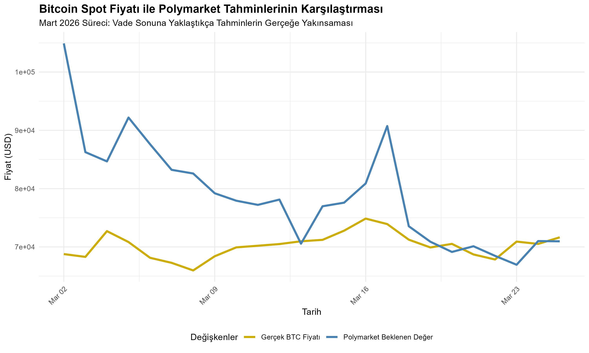

# 📈 A Time Series Analysis of Bitcoin’s Spot Price Using Polymarket Predictions


## 📌 Executive Summary
This research project examines the dynamic relationship between participant expectations in decentralized prediction markets and the actual spot price of an asset, such as Bitcoin. The study constructed a mathematical **Expected Value (EV)** time series using daily probability distributions (Dip, Reach, and Middle Zone) extracted from the “March 2026 Price Targets” contracts on Polymarket, and subsequently analyzed this series against actual spot prices using a Multiple Linear Regression model with a time.
---

## 🏛️ 1. Theoritical Framework and Literature Review
Price formation in markets revolves around information asymmetry and market efficiency. This project is built upon two fundamental theory 
1. **Wisdom of Crowds:** Surowiecki (2004), argues that the collective predictions of market participants are often more accurate than those of experts. Prediction markets (such as Polymarket) are a financial manifestation of this theory.
2. **Efficient Market Hypothesis - EMH:** ccording to the hypothesis formulated by Fama (1970), market prices instantly reflect all available information. Therefore, past price (or expectation) movements cannot be used to predict future prices.

---

## 🎯 2. Research Goals and Hypothesis 
The primary objective of the project is to measure the rate at which market expectations rationalize over time and their predictive power.

* **$H_1$:** As the time to maturity ($t \rightarrow 0$) decreases, the spread between the Expected Value (EV) in prediction markets and the actual spot price narrows (Convergence Hypothesis).
* **$H_2$:** The explanatory power of lagged forecasts (t-1, t-3, t-7) for today’s spot price is low; the market quickly prices in real-time information.

---

## ⚙️ 3. Methodological Data Mining

### 3.1. Data Science
* **Spot Price:** Yahoo Finance API (`quantmod` Library) daily BTC closing prices source.
* **Forecasting** Extracted using Polymarket’s API architecture:
  * *Gamma API:*To extract the unique `clobTokenIds` values of Market IDs.
  * *CLOB API (Central Limit Order Book):* To retrieve historical daily closing probabilities using the `prices-history` endpoint via token IDs.

### 3.2. Full Probability Distribution and EV Modeling

All contract tiers were analyzed to distill market expectations into a single figure. The formula was constructed:

$EV = \sum_{i=1}^{n} (P_{dip\_i} \times V_i) + (P_{mid} \times V_{mid}) + \sum_{j=1}^{m} (P_{reach\_j} \times V_j)$

* $P$ represents the calculated marginal probability, and $V$ represents the target price level.*

---

## 📊 4. Exploratory Data Analysis



**Graph Comment:** Looking at the time series, we see that the EV line is quite volatile at the beginning of the contract period (a period of low liquidity and high speculation). However, as the contract period nears its end, we observe that Polymarket participants’ predictions rapidly converge toward the actual BTC spot price (assuming $H_1$).


---

## 📈 5. Statistical Results and Regression Analysis 

To test the effect of LAG variables on price, multiple linear regression was performed using the Ordinary Least Squares method.

| Variable | Estimate | Standart Error | t-Value | p-Value (Pr>\|t\|) |
| :--- | :--- | :--- | :--- | :--- |
| **(Intercept)** | 8.331e+04 | 1.067e+04 | 7.810 | 4.8e-06 *** |
| **EV_Lag_1** | 8.131e-02 | 8.757e-02 | 0.928 | 0.371 |
| **EV_Lag_3** | -1.511e-01 | 8.740e-02 | -1.729 | 0.109 |
| **EV_Lag_7** | -1.135e-01 | 6.880e-02 | -1.649 | 0.125 |
| **Days_to_Exp** | 1.748e+02 | 1.581e+02 | 1.105 | 0.291 |

* **Model Performance:** `Multiple R-squared: 0.3421`. Model explains %34 of price variances.
* **Correlation:** A moderate positive correlation (**r = 0.547**) was found between the spot price and the EV.
* **EMH Approvation:** $H_2$ the Hypothesis has approved. `EV_Lag_1`, `EV_Lag_3` ve `EV_Lag_7` variables' t-value> 0.05'tir.This situation demonstrates that past expectations are insufficient to explain today’s spot price and that the Efficient Market Hypothesis remains valid in cryptocurrency prediction markets as well.


---

## ⚠️ 6. Limitations
The regression model has 12 degrees of freedom. The main reason for this low value is the sample restriction. The 7 days lag analysis resulted in the removal of the first 7 days of data from the time series. Future research utilizing ARIMA or Vector Autoregression models with broader datasets spanning 6 months or 1 year would contribute to the literature.


---

## 📁 7. Repository Structure

This project structured regarding to best practices applications:

```text
📂 project-root/
├── 📁 01-data_raw/             # Raw, unprocessed JSON/CSV data retrieved from APIs
├── 📁 02-data_preprocessed/    # Cleaned, unified, ready EV tables
├── 📁 03-scripts/              # R based data mining, data processessing and code chunks
├── 📁 04-results/              # Regression Table
├── 📁 05-plots/                # Explaretory Data Analysis(EDA) Graphics
└── 📄 README.md                # Documentation
